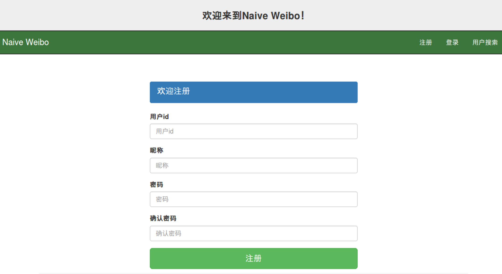
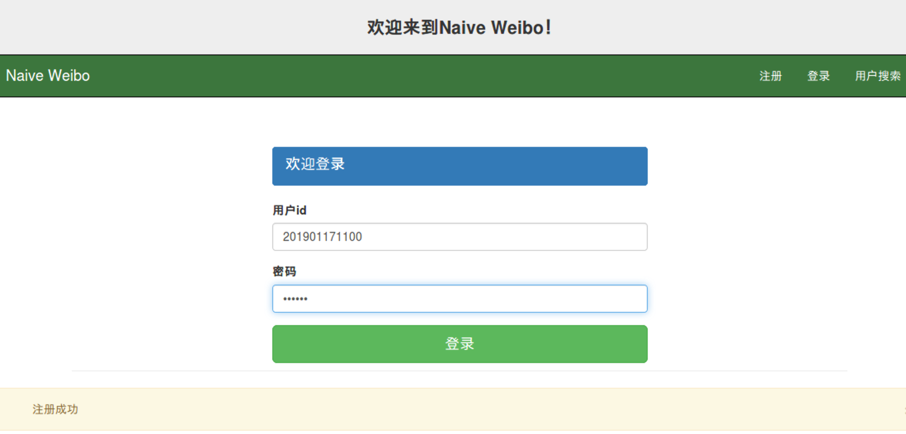
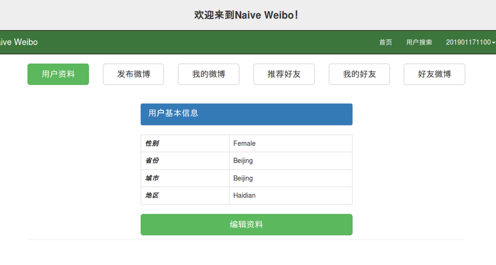
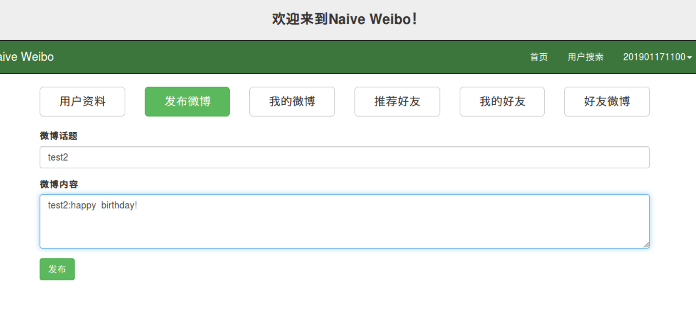
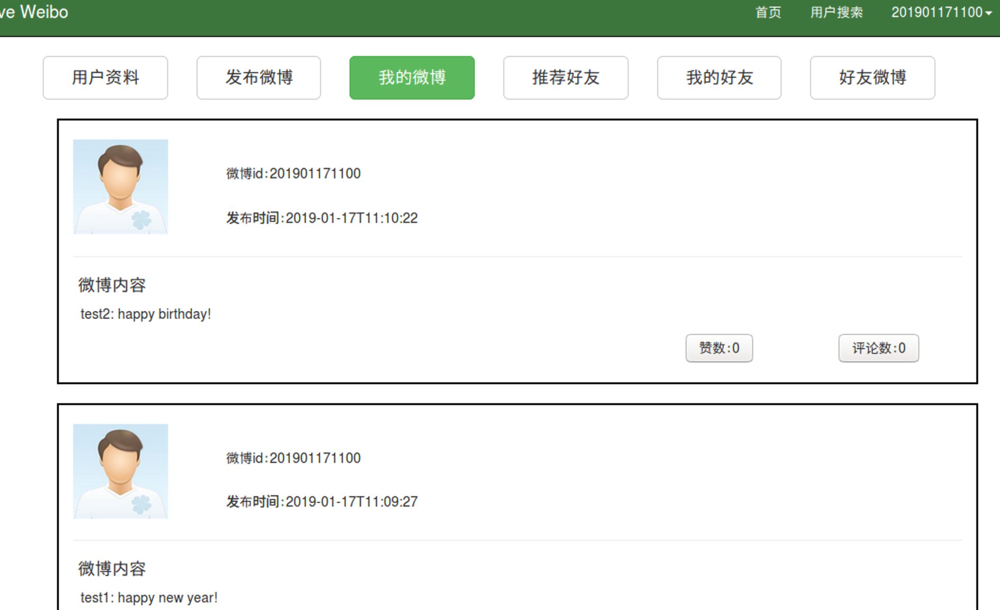
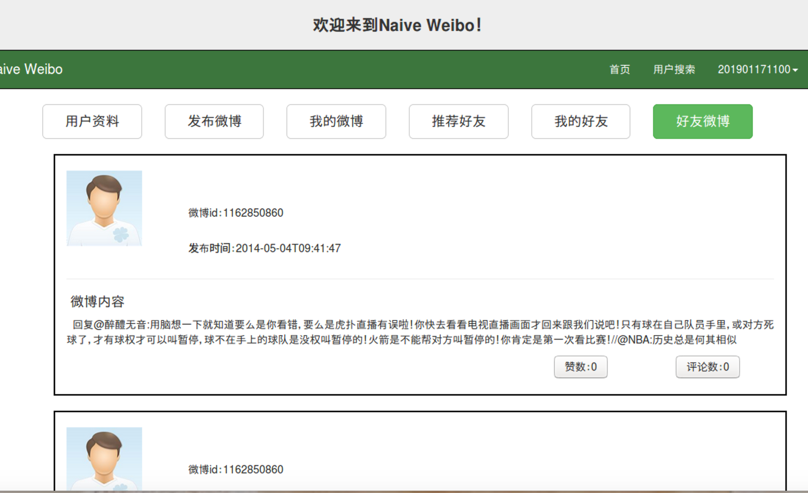
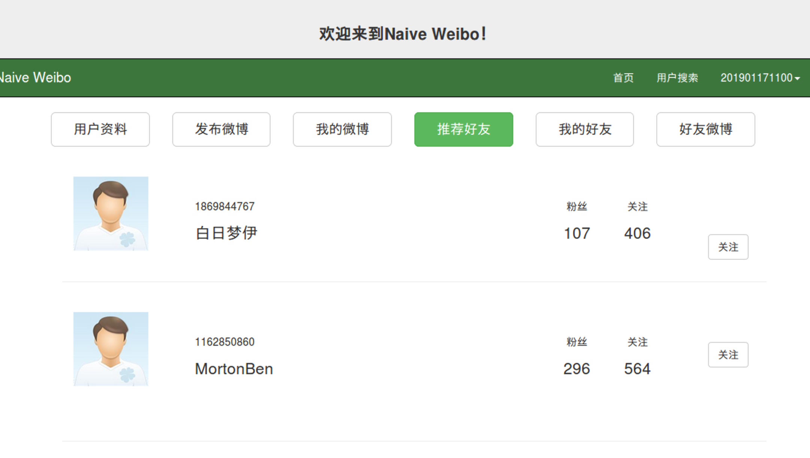
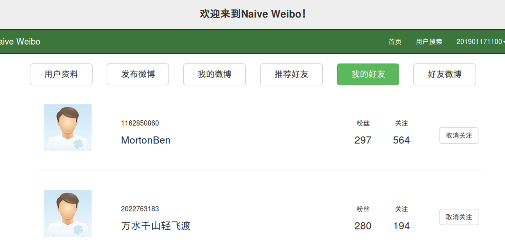
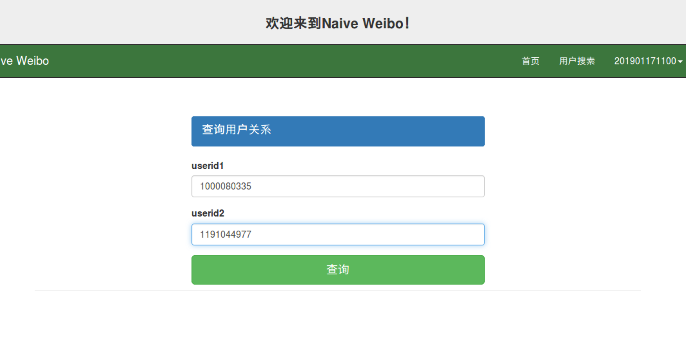
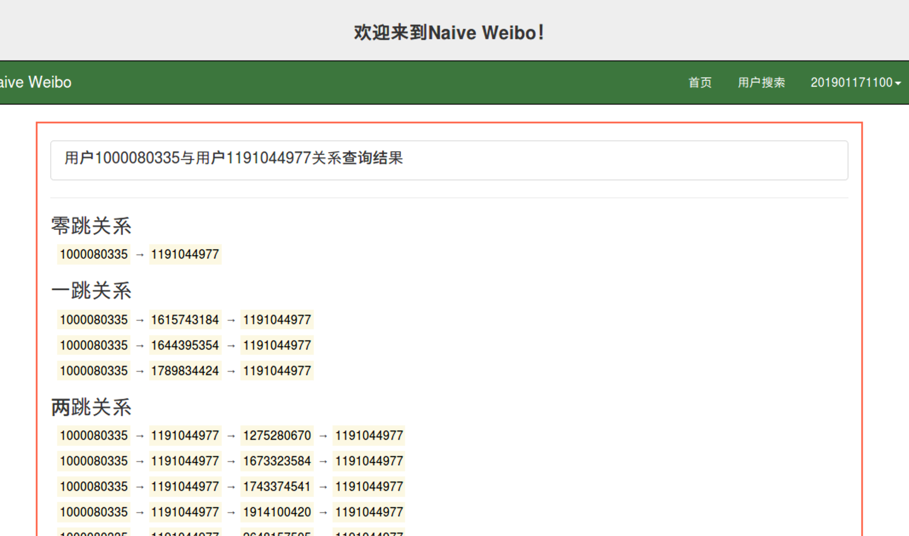

## 框架（Framework）

+ 前端框架（front-end frame ）: Bootstrap3.3.7
   +  网页设计在templates文件夹里面（front-end design in the templates folder）
+ 后端框架（back-end frame）:  Flask
   +  后端设计在back_end文件夹中（back-end design in the back_end folder）
+ 图数据引擎系统（graph data management system）：gStore

## Naive Weibo
### 注册（register）

### 登录（login）

### 编辑资料（edit profile）

### 发送微博 （post a message）

### 查看已发布微博（look at the messages posted）

### 查看好友微博 （get the posted messages of friends）

### 关注他人 （follow others, click the button "关注"）

### 取消关注他人 （unfollow others, click the button "取消关注"）

### 查询用户关系 （get the relationship of two users/get following chain）
+ 输入两个用户ID（input ID of two users）

+ 得到查询结果（get following chain）

